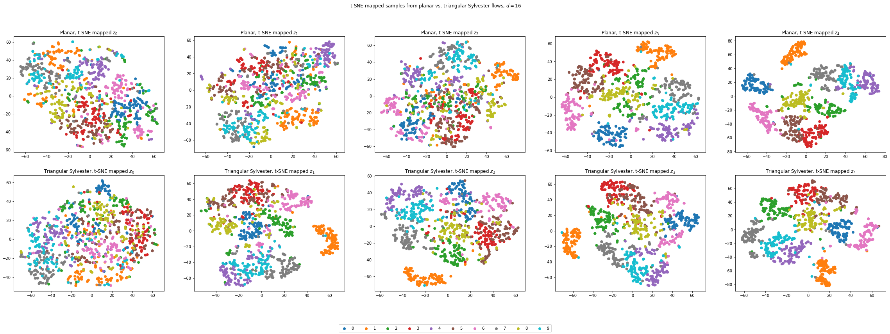

# normalizing-flows

Implementations of normalizing flows for variational inference using Python (3.6+) and Tensorflow (2.0+).

## Installation

    pip install git+https://github.com/bgroenks96/normalizing-flows
    
## Getting started

Take a look at the [intro notebook](normalizing-flows-intro.ipynb) for a gentle introduction to normalizing flows.

This library currently implements the following flows:

- Planar/radial flows [(Rezende and Mohamed, 2015)](https://arxiv.org/pdf/1505.05770.pdf)

- Triangular Sylvester flows [(Van den Berg et al, 2018)](https://arxiv.org/pdf/1803.05649.pdf)

- Glow [(Kingma et al, 2018)](https://papers.nips.cc/paper/8224-glow-generative-flow-with-invertible-1x1-convolutions.pdf)

More types of flows will be added as-needed. Contributions and discussions about new proposed architectures is welcome!

Additional types flows under consideration for future versions:

- Orthogonal/Householder Sylvester flows

- Inverse Autoregressive Flows (Kingma et al, 2016)

- Neural Autoregressive Flows (Huang et al, 2018)

Currently, this library has no published documentation outside of docstrings in the code. This may change in the future.

Please feel free to create an issue if anything isn't clear or more documentation is needed on specific APIs.

## License and use

This library is free and open source software under the MIT license.